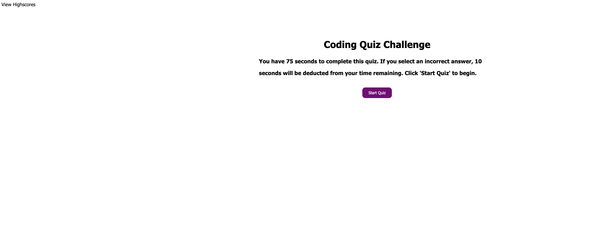
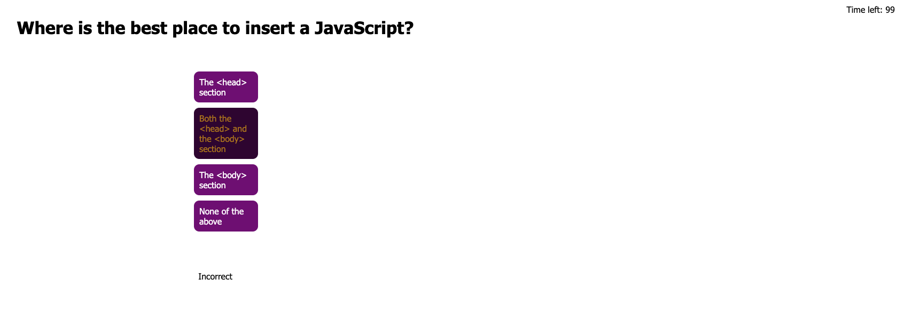
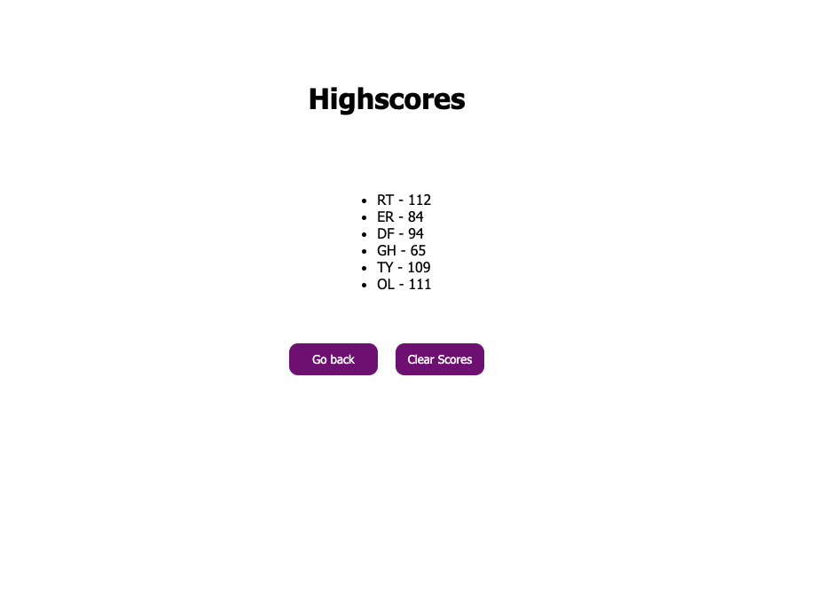

# code-quiz-week-3

## Description

This project was built to serve as a website that someone will be able to use to answer basic JavaScript questions. When the user is done, they can save their scores on a new screen. I learned a lot about using JavaScript to make my website function much more dynamically. I was able to load totally new pages by listening for click events and also learned how to utilize a website's localStorage feature.

## Usage

Upon loading my coding quiz website, you will find a brief description of the quiz, a link in the top corner to go to the page that displays all stored highscores, and also a button you can click to begin the quiz.

After the "Start Quiz" button is clicked on, the website will then load in the first question, a set of answers, and also begin a timer in the top right corner.

Once a user decides to answer a question, you will notice that each question once hovered over, will prompt the user to click on whichever question they decide is right. After the user clicks this answer, a message will display below the answers that says if the user was Correct or Incorrect. If the answer is incorrect, the time left will be reduced by 10 seconds.

The quiz will end when the user answers all questions or if the time runs out. When this happens, a new page will load that displays their final score (final score is equal to the amount of time left at the end of the quiz), and will prompt them to enter their initials.

When the user has entered their initials and clicks the "Submit" button, the final screen of the quiz will display. This screen shows all of the scores that have been entered after a quiz has been taken. If the user clicks the link at the top left of the screen "View Highscores", it will also take them to this same page.

The user now has two final options. The first option is they can click on the button "Go back", as shown in the previous image. This will bring the user back to the start of the JavaScript Quiz. The other option the previous image shows, is clicking the button "Clear Scores". This will clear out all of the highscores that have been saved into the website's localStorage.

## Credits

I would like to give some credit to my Tutor that helped me with this project. His name is Blake Davis. He helped me a lot with setting up a good game plan by pseudocoding with me, and also gave me great advice on how to use the localStorage to store all of the highscores.